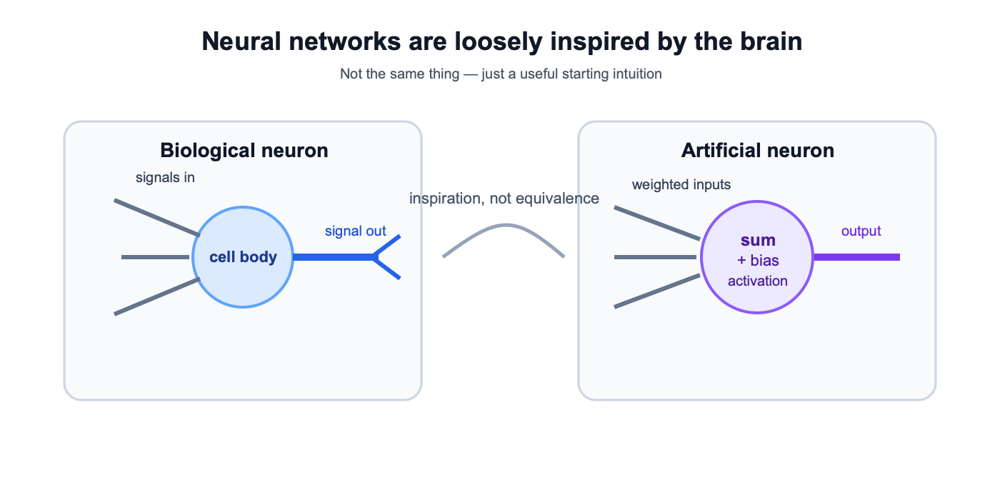
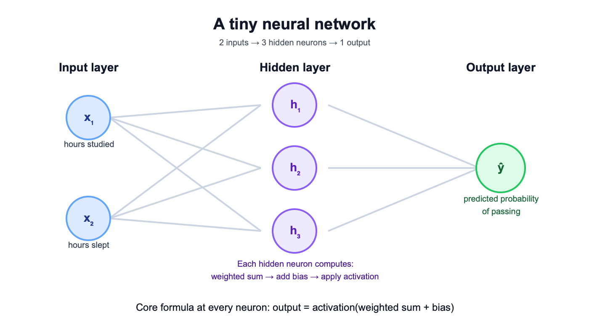
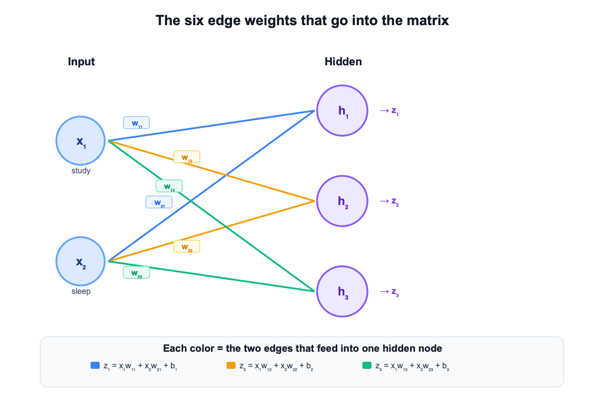
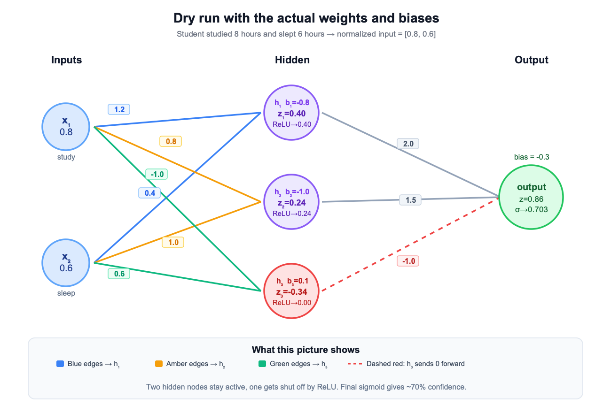

# Neural Networks — Let’s Build the Intuition First

Have you ever seen one of those brain animations where signals jump from one neuron to another? A few neurons light up, the signal keeps moving, and finally something happens.
[Neuron firing GIF](https://media0.giphy.com/media/v1.Y2lkPTc5MGI3NjExd3JlZ2NwbnR3M2sxeHkyNHVmYXU0eWw2d2ZlcnN5aDVlcWtocjNkNSZlcD12MV9pbnRlcm5hbF9naWZfYnlfaWQmY3Q9Zw/ja0M23DE1fipScX58W/giphy.gif)

That picture is useful.

Not because neural networks are literally brains. They are not.

But it gives us a good starting intuition:

- something receives a signal
- only some parts respond
- the signal gets passed forward
- and eventually a final response comes out

That is close enough to help us begin.

## The brain analogy, in a very simple way

Your brain is made of neurons connected to other neurons.

If you touch something cold, that signal travels through a chain of neurons. Some of them respond, some of them do not, and eventually your body reacts.

The important part here is not the biology.
The important part is the pattern:

- input comes in
- some internal units react
- the active ones pass the signal forward
- and a final decision or action comes out

That is the basic intuition we borrow in neural networks.



## So what is a neural network in simple words?

A neural network is a system that takes some input, pushes it through layers of connected nodes, and produces an output.

In place of biological neurons, we use nodes.
In place of biological connections, we use weighted connections.
And instead of a physical reaction, we produce a prediction.

Usually the structure looks like this:

- the input layer receives the data
- every node in one layer connects to all the nodes in the next layer
- the hidden layer or hidden layers process it
- the output layer gives the final answer

That full-connect pattern is important. The input does not choose just one path. It fans out to the next layer through multiple connections.

That is the whole high-level picture.

## Let’s use one concrete example

Imagine a college has been tracking two simple things before each exam:

- how many hours a student studied
- how many hours a student slept

And for each student, they also know whether that student passed.

A tiny toy dataset might look like this:

| Student   | Study (hrs) | Sleep (hrs) | Result |
| --------- | ----------- | ----------- | ------ |
| Student 1 | 8           | 6           | Pass   |
| Student 2 | 2           | 10          | Fail   |

Now the question is:

Can we build a small neural network that looks at study and sleep hours and gives us a prediction?

That is the problem we want to solve.

## Let’s build a tiny network

We have two inputs:

- x1 = study hours
- x2 = sleep hours

We will use one hidden layer with three nodes:

- h1
- h2
- h3

And then one output node that tells us how likely the student is to pass.

So this network is:

- 2 input nodes
- 3 hidden nodes
- 1 output node



At this point, a natural question comes up.

Why do we even need those hidden nodes in the middle?

Because the network usually should not jump straight from raw numbers to a final answer. It helps to build a few intermediate signals first.

You can loosely think of the hidden nodes like this:

- one node may respond more to study
- one may respond more to sleep
- one may respond to the balance between both

That is not a literal rulebook inside the model. It is just a good way to build intuition.

## How does the network decide what matters more?

Now imagine I give you a new student:

- studied for 2 hours
- slept for 10 hours

If I ask you whether that student is likely to pass, you will probably say something like:

“They slept well, but they barely studied, so probably not.”

Notice what you just did.

You did not treat both inputs equally.
You gave more importance to study than sleep.

That is exactly why neural networks need weights.

## Weights are just importance numbers

A weight is the number attached to a connection.

Its job is simple: tell the network how much that connection should matter.

So if study matters more, the connections carrying study information should get higher weights.
If sleep matters less, its weights can be smaller.
If a signal should work against the final prediction, a weight can even be negative.

So the simple definition is:

A weight is just a number that says how important a connection is.

That is all.

## From individual edge weights to matrix notation

Now look at the network again.

We have 2 input nodes and 3 hidden nodes.
That means every input connects to every hidden node.

So we do not have just one weight.
We have six of them:

- from x1 to h1, h2, h3
- from x2 to h1, h2, h3

If we name them carefully, we get:

- w11, w12, w13
- w21, w22, w23

Here is the network view first.



This is the version you can reason through directly.
You can follow each edge and see which weight belongs to which connection.

If we now write the hidden-node scores one by one, we get:

```text
z1 = x1×w11 + x2×w21 + b1
z2 = x1×w12 + x2×w22 + b2
z3 = x1×w13 + x2×w23 + b3
```

Here z1, z2, and z3 are the raw scores for h1, h2, and h3 before activation is applied.

We can write the same thing more compactly using a matrix:

```text
W = [ [w11, w12, w13],
      [w21, w22, w23] ]
```

So matrix multiplication is not a separate idea from the network.

It is just a compact way to say:

“Take all the inputs, send them through all the weighted connections, and compute all hidden-node scores together.”

That is where the matrix comes from.

## Where bias fits in

There is one more idea we need before a node can really make a decision.

Suppose a hidden node receives some weighted input and gets a score.
Even then, you may still want to say:

“This score is not strong enough yet. Do not react too early.”

That is what bias helps with.

A simple way to think about bias is this:

Bias shifts how easy or hard it is for a node to respond.

If weights decide what matters, bias helps decide how much is enough.

So for one hidden node, the calculation starts like this:

```text
score = (input × weights) + bias
```

Or more concretely:

```text
z1 = x1×w11 + x2×w21 + b1
z2 = x1×w12 + x2×w22 + b2
z3 = x1×w13 + x2×w23 + b3
```

These z-values are just the raw scores before we decide what to do with them.

## When does a node actually pass its signal forward?

Now comes the next question.

If a node gets a raw score, should it always pass that score forward exactly as it is?

Not necessarily.

Sometimes we want behavior like this:

- if the signal is useful, let it pass
- if the signal is weak or negative, block it

That filtering step is what activation does.

So if bias helps decide how much is enough, activation is the gate that decides what actually goes forward.

There is also an important reason activation functions matter mathematically.
If we do not use them, then every layer is only doing a weighted sum plus bias.

For the hidden layer, that would mean:

```text
z = XW1 + b1
h = z
```

The output layer would then become:

```text
output = hW2 + b2
       = (XW1 + b1)W2 + b2
       = X(W1W2) + (b1W2 + b2)
```

So even after stacking two layers, we are still left with one linear expression of the input.
That is the reason people say the network collapses into a single linear transformation when there is no activation between layers.

In practical terms:

- without activation, multiple layers behave like one linear layer
- the network cannot model richer curved patterns very well
- adding more layers would not buy us much

For this example, we can use a very simple rule:

- if the score is positive, keep it
- if the score is negative, turn it into 0

That rule is called ReLU.

So the full idea for one node becomes:

```text
output = activation(weighted sum + bias)
```

Now that formula should feel more grounded.
It is just a compact version of the logic we already built in words.

## Let’s do one small dry run

Now let’s use the same example from above.

Take a student who:

- studied for 8 hours
- slept for 6 hours

To keep the numbers tidy, we scale them down:

- x1 = 0.8
- x2 = 0.6

Before jumping to the matrix version, it helps to see the actual network with the exact weights on each edge and the bias shown on each hidden node.



Now let us say the hidden layer uses these weights:

```text
W = [ [ 1.2,  0.8, -1.0],
      [ 0.4,  1.0,  0.6] ]
```

And these biases:

```text
b = [ -0.8, -1.0, 0.1 ]
```

### Hidden node h1

```text
z1 = 0.8×1.2 + 0.6×0.4 - 0.8
   = 0.96 + 0.24 - 0.8
   = 0.40
```

After ReLU:

```text
h1 = 0.40
```

### Hidden node h2

```text
z2 = 0.8×0.8 + 0.6×1.0 - 1.0
   = 0.64 + 0.60 - 1.0
   = 0.24
```

After ReLU:

```text
h2 = 0.24
```

### Hidden node h3

```text
z3 = 0.8×(-1.0) + 0.6×0.6 + 0.1
   = -0.8 + 0.36 + 0.1
   = -0.34
```

After ReLU:

```text
h3 = 0
```

That is a really useful moment to pause.

We had three hidden nodes.
But only two stayed active.
The third one got shut off.

That is exactly what people mean when they say not all neurons fire for every input.

After you understand it node by node like this, the matrix version is just the compact notation for the same computation.

## How do we get the final output?

Now the output node takes these hidden activations:

- h1 = 0.40
- h2 = 0.24
- h3 = 0.00

It combines them using another set of weights.

For this example, let us use:

```text
output weights = [2.0, 1.5, -1.0]
output bias = -0.3
```

So the raw output score becomes:

```text
score = 0.40×2.0 + 0.24×1.5 + 0×(-1.0) - 0.3
      = 0.80 + 0.36 - 0.3
      = 0.86
```

That is still just a raw number.

To turn it into something easier to read, we use one final activation at the output. In this case, we use sigmoid, which converts the score into a value between 0 and 1.

So:

```text
sigmoid(0.86) ≈ 0.703
```

Which we can read as:

```text
about a 70.3% chance of passing
```

## So where did the big formula come from?

Now you can see the whole path clearly.

- some inputs matter more than others
- a node should not react too easily
- not every raw signal should pass through
- several small signals can combine into a final decision

Once you write those ideas mathematically, you naturally arrive at:

```text
output = activation(X · W + b)
```

So this formula is not the idea itself.
It is just the compressed version of the idea.

## A quick note on other activation functions

For this article, ReLU and sigmoid are enough.
They cover the two roles we needed:

- ReLU for deciding whether a hidden signal should continue
- sigmoid for turning the final score into a probability-like output

There are other activation functions too — tanh, softmax, GELU, and more — but we do not need them for this explanation.
