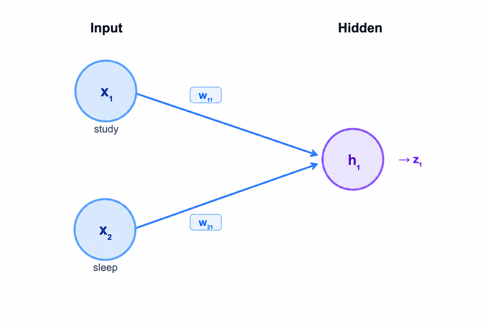

# Neural Networks

Have you ever seen one of those brain animations where signals jump from one neuron to another? A few neurons light up, the signal keeps moving, and finally something happens.

[Neuron firing GIF](https://media0.giphy.com/media/v1.Y2lkPTc5MGI3NjExd3JlZ2NwbnR3M2sxeHkyNHVmYXU0eWw2d2ZlcnN5aDVlcWtocjNkNSZlcD12MV9pbnRlcm5hbF9naWZfYnlfaWQmY3Q9Zw/ja0M23DE1fipScX58W/giphy.gif)

That picture is useful — not because neural networks are literally brains, but because it gives us a good starting intuition: a signal comes in, some parts respond, and eventually a final answer comes out.

## The brain analogy, in a very simple way

Your brain is made of neurons connected to other neurons.

If you touch something cold, that signal travels through a chain of neurons. Some of them respond, some do not, and eventually your body reacts.

The important part is not the biology. It is this pattern:

> input comes in → some internal units react → active ones pass the signal forward → a final decision comes out

That is the intuition we borrow. A neural network does the same thing — but with numbers instead of biology.


## So what is a neural network in simple words?

A neural network is a system that takes some input, pushes it through layers of connected nodes, and produces an output.

In place of biological neurons, we use nodes.
In place of biological connections, we use weighted connections.
And instead of a physical reaction, we produce a prediction.

The structure usually looks like this:

- the input layer receives the data
- every node in one layer connects to all the nodes in the next layer
- the hidden layer or layers process it
- the output layer gives the final answer

That full-connect pattern is important. The input does not choose just one path. It fans out to the next layer through multiple connections.

## Let's build a tiny network

Imagine we want to predict whether a student will pass an exam based on two things:

- x1 = study hours
- x2 = sleep hours

We will use one hidden layer with three nodes — h1, h2, h3 — and one output node that tells us how likely the student is to pass.

So this network is:

- 2 input nodes
- 3 hidden nodes
- 1 output node


Why do we need hidden nodes in the middle at all? Because it helps to build intermediate signals before jumping to a final answer.

## How does the network decide what matters more?

Now imagine a student who studied for 2 hours and slept for 10 hours. If I ask you whether they will pass, you would probably say: "They slept well, but barely studied — probably not."

Notice what you just did. You did not treat both inputs equally. You gave more importance to study than sleep.

## Weights

A weight is the number attached to a connection. Its job is simple: tell the network how much that connection should matter.

If study matters more, the connections carrying study information get higher weights.
If sleep matters less, its weights can be smaller.
If a signal should work against the final prediction, a weight can even be negative.

A weight is just a number that says how important a connection is.

## Choosing weights by hand

We have 2 inputs and 3 hidden nodes. Every input connects to every hidden node, so we have six weights in total:

```
x1 to h1 → w11
x1 to h2 → w12
x1 to h3 → w13

x2 to h1 → w21
x2 to h2 → w22
x2 to h3 → w23
```

Now, suppose we give each hidden node a specific role:

- **h1** responds only to study
- **h2** responds only to sleep
- **h3** considers both equally


If you were asked to choose the weights yourself, how would you pick them?

**For h1 (study only):** give 100% weight to study, 0% to sleep.

```
w11 = 1.0
w21 = 0.0
```

**For h2 (sleep only):** give 100% weight to sleep, 0% to study.

```
w12 = 0.0
w22 = 1.0
```

**For h3 (both equally):** give 50% to each.

```
w13 = 0.5
w23 = 0.5
```



Now we can compute each hidden node's raw score:

```
z1 = x1×1.0 + x2×0.0   →  only study matters
z2 = x1×0.0 + x2×1.0   →  only sleep matters
z3 = x1×0.5 + x2×0.5   →  both matter equally
```

This is the full calculation written out individually. Now notice something: we are doing the same structure of operation — multiply each input by a weight, then add — for every single hidden node.

We can pack the inputs into a 1×2 matrix:

```
[x1,  x2]
```

And pack all the weights into a 2×3 matrix:

```
W = [ [w11, w12, w13],
      [w21, w22, w23] ]

  = [ [1.0,  0.0,  0.5],
      [0.0,  1.0,  0.5] ]
```

Matrix multiplication then gives us all three scores at once:

```
[x1, x2] × [ [1.0,  0.0,  0.5],    =   [x1×1.0 + x2×0.0,
              [0.0,  1.0,  0.5] ]        x1×0.0 + x2×1.0,
                                         x1×0.5 + x2×0.5]

           =  [z1,  z2,  z3]
```

So matrix multiplication is not a separate idea. It is just a compact way to say: take all the inputs, send them through all the weighted connections, and compute all hidden node scores in one step.

## Where bias fits in

There is one more idea we need before a node can really make a decision.

Suppose a hidden node receives some weighted input and gets a score. Even then, you may still want to say: "This score is not strong enough yet. Do not react too early."

That is what bias helps with.

If weights decide what matters, bias helps decide how much is enough. It shifts how easy or hard it is for a node to respond.

So the full score for each hidden node becomes:

```
z1 = x1×w11 + x2×w21 + b1
z2 = x1×w12 + x2×w22 + b2
z3 = x1×w13 + x2×w23 + b3
```

These z-values are the raw scores before we decide what to do with them.

## What happens without activation

Now a natural question: should a node always pass its raw score forward exactly as it is?

Not necessarily. Sometimes we want behavior like this — if the signal is useful, let it pass; if it is weak or negative, block it. That filtering step is what activation does.

But there is a deeper reason activation functions matter, and it is worth understanding clearly.

If we skip activation entirely, every layer is just doing: weighted sum + bias. Stack two layers and see what happens:

```
Hidden layer:   z  = X·W1 + b1
Output layer:   out = z·W2 + b2
                    = (X·W1 + b1)·W2 + b2
                    = X·(W1·W2) + (b1·W2 + b2)
```

That final line is still just one linear expression of X — a straight-line relationship between input and output. No matter how many layers we add, without activation between them, the whole network collapses into a single linear transformation. Every extra layer we add buys us nothing.

That is the core problem. Real-world patterns are rarely a straight line. Adding activation between layers breaks the linearity, and suddenly multiple layers can actually learn richer, curved, more complex relationships.

For the hidden layer, we use ReLU — a very simple rule:

- if the score is positive, keep it
- if the score is negative, turn it to 0

So the full idea for one hidden node is:

```
output = ReLU(weighted sum + bias)
```

## Running a student through the network

Take a student who studied for 8 hours and slept for 6 hours. We scale them down:

- x1 = 0.8
- x2 = 0.6


Hidden layer weights:

```
W = [ [ 1.2,  0.8, -1.0],
      [ 0.4,  1.0,  0.6] ]
```

Biases:

```
b = [ -0.8, -1.0, 0.1 ]
```

**Hidden node h1**

```
z1 = 0.8×1.2 + 0.6×0.4 - 0.8
   = 0.96 + 0.24 - 0.8
   = 0.40

h1 = ReLU(0.40) = 0.40
```

**Hidden node h2**

```
z2 = 0.8×0.8 + 0.6×1.0 - 1.0
   = 0.64 + 0.60 - 1.0
   = 0.24

h2 = ReLU(0.24) = 0.24
```

**Hidden node h3**

```
z3 = 0.8×(-1.0) + 0.6×0.6 + 0.1
   = -0.8 + 0.36 + 0.1
   = -0.34

h3 = ReLU(-0.34) = 0
```

That is worth pausing on. We had three hidden nodes, but only two stayed active. The third one got shut off.

That is exactly what people mean when they say not all neurons fire for every input.

## The output layer

The output node takes the hidden activations:

- h1 = 0.40
- h2 = 0.24
- h3 = 0.00

And combines them using another set of weights:

```
output weights = [2.0, 1.5, -1.0]
output bias    = -0.3
```

Raw score:

```
score = 0.40×2.0 + 0.24×1.5 + 0×(-1.0) - 0.3
      = 0.80 + 0.36 - 0.3
      = 0.86
```

That is still just a raw number. To turn it into something readable, we apply sigmoid at the output.

Sigmoid takes any number — large, small, positive, negative — and squashes it into a value between 0 and 1. That makes the output easy to read as a probability. A score of 0.86 goes in, and something close to 0.7 comes out, which we can read directly as "roughly a 70% chance of passing."

```
sigmoid(0.86) ≈ 0.703
```

Which means: about a 70.3% chance of passing.

ReLU and sigmoid play different roles here. ReLU acts as a gate inside the network — it decides whether an intermediate signal is strong enough to keep moving. Sigmoid acts as an interpreter at the end — it translates the final raw score into a probability that a human can actually read.

## Putting it all together

Now you can see the whole path clearly.

- some inputs matter more than others → **weights**
- a node should not react too easily → **bias**
- not every raw signal should pass through → **activation**
- several small signals combine into a final decision → **layers**

Once you write those ideas mathematically, you naturally arrive at:

```
output = activation( X · W + b )
```

Where:

- **X** is the input
- **W** is the weight matrix — how much each connection matters
- **b** is the bias — how much push a node needs before it reacts
- **activation** is the gate that decides what actually goes forward

## This is the foundation everything else is built on

The network we just walked through had only a handful of weights.

GPT, Claude, and Gemini are built on this exact same foundation — the same structure and the same core math. The difference is scale.

Where our example had a few dozen weights, modern models have billions. Where we used one hidden layer, they use hundreds.

So when you hear something like “100 billion parameters,” that number is mostly counting weights and biases — the same concepts you just learned about.

The architecture becomes far more sophisticated, but at its core, the model is still doing the same thing:
multiplying inputs by weights, combining information, and learning which patterns matter.

## How the network learns its weights

So far we chose weights by hand — study matters more than sleep, so give it a higher weight. But in a real network with millions of connections, no human can hand-pick every number. The network has to figure them out on its own.

It does this in two stages: start random, then improve step by step using a method called backpropagation.

## A quick note on Activation Functions

For this article, ReLU and sigmoid are enough. They cover the two roles we needed:

- ReLU for deciding whether a hidden signal should continue
- sigmoid for turning the final score into a probability-like output

There are other activation functions too — tanh, softmax, GELU, and more — but we do not need them for this explanation.
